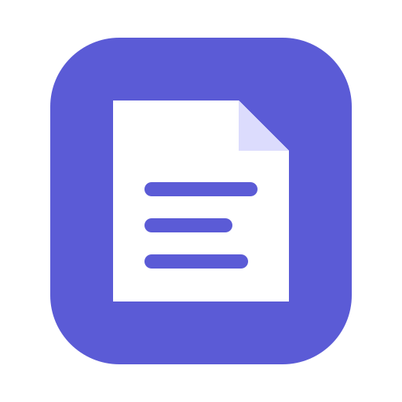
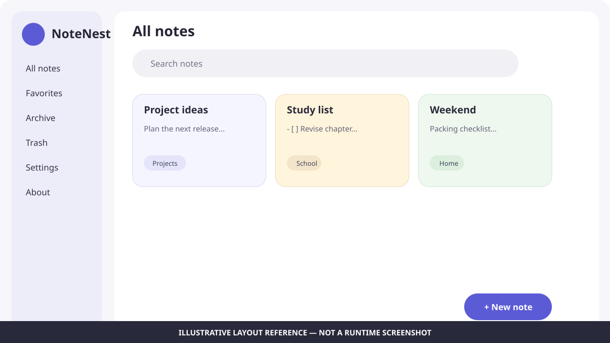

<div align="center">
  

# NoteNest

**Your thoughts, safely nested.**

A private, offline-first notes app built with Flutter, Dart, Drift, and SQLite.

**Current release-candidate target: 2.0.12 (`2.0.12+2012`)**

[](https://github.com/sanskarIN/notenest/actions/workflows/ci.yml)
[](LICENSE)
[](https://buymeacoffee.com/sanskarIN)

**Made by the Sanskar**
</div>

---

## Release status

NoteNest `main` is currently prepared as a **2.0.12 release candidate**, not yet claimed as a fully verified stable release.

The package/visible/changelog/release-note version surfaces and exact Flutter workflow pins are synchronized by `tool/check_version_sync.py`, and the current package version is `2.0.12+2012`. The repository also maintains an exhaustive tracked-file catalog in `docs/repository-reference.md`, enforced by `tool/check_repository_reference.py`. A `v2.0.12` tag should be created only after configured CI/native builds and the documented manual platform/accessibility checks pass on the exact candidate commit.

See:

- [`CHANGELOG.md`](CHANGELOG.md)
- [`docs/releases/2.0.12.md`](docs/releases/2.0.12.md)
- [`docs/release.md`](docs/release.md)
- [`docs/repository-reference.md`](docs/repository-reference.md)
- [`what_changed.md`](what_changed.md)

## Why NoteNest?

NoteNest is designed for people who want a serious notes experience without requiring an account, project-operated cloud service, or permanent internet connection. Notes live in a local Drift/SQLite database, search uses SQLite FTS5, edits autosave, earlier content is preserved as snapshots, and users explicitly choose when to import/export files or open external project/support links.

The repository is structured as a production-oriented open-source project rather than a framework demo. It includes modular application code, storage/import validation, deterministic regression tests, security/privacy documentation, GitHub automation, accessibility guidance, release procedures, and a detailed engineering handoff.

## Screenshots

Real device captures belong in [`docs/assets/screenshots/`](docs/assets/screenshots/). Until verified runtime captures are produced by the release-validation environment, the repository uses a clearly labeled illustrative layout reference rather than presenting a mockup as a real screenshot.



## Features

### Notes and organization

- Create and edit local notes.
- Automatic local saving with a debounce before persistence submission.
- Serialized editor writes so an older submitted autosave cannot overtake a newer one.
- Pin important notes.
- Mark notes as favorites.
- Archive notes without deleting them.
- Move notes to trash, restore them, delete one permanently, or empty trash.
- Organize with folders and normalized comma-separated tags.
- Give notes optional colors with explicit selected semantics and a non-color checkmark cue.
- Filter by collection, folder, and tag.
- Collection-specific folder/tag metadata for All Notes, Favorites, Archive, and Trash.
- Switching collections clears stale folder/tag filters.
- Fast full-text search backed by SQLite FTS5.
- Collection-specific empty states avoid offering actions whose result would be hidden by the current collection.

### Writing experience

- Distraction-free editor mode.
- Markdown-lite helpers for headings, emphasis, bullet lists, and checklists.
- First-line Markdown prefix actions correctly target an empty first line when the caret is at offset zero.
- Accessible text sizing and Material 3 typography.
- Immutable draft capture before each submitted save.
- Save-state feedback that does not report a stale draft as current.
- Version snapshots before changed content is persisted.
- Restore an earlier version from note history.

### Import, export, and recovery

- Import UTF-8 Markdown, Markdown-like text, and text files as notes.
- Native import uses cached file paths and a bounded reader rather than requesting eager NoteNest byte loading.
- Markdown/text import ceiling: **16 MiB**.
- NoteNest JSON backup import ceiling: **64 MiB**.
- Strict UTF-8 decoding after the bounded read.
- Export an individual note as Markdown with small NoteNest front-matter metadata.
- Cross-platform-safe Markdown filenames.
- Protection against Windows reserved device names and trailing dots/spaces.
- Unicode-safe filename truncation that does not split surrogate pairs/code points.
- Export all notes and snapshots as human-readable JSON.
- Validate backup application identity, schema version, field types, serialized tags, IDs, note/version relationships, UTC timestamps, timestamp order, and 32-bit ARGB colors before restore writes.
- Conflict-safe restore: an older backup does not overwrite a newer local note.
- Restore operations use a database transaction.

### Settings and onboarding reliability

- Light, dark, and system appearance modes.
- Adjustable text scale.
- Reduced-motion preference.
- Optional local app-lock preference.
- Preference writes are serialized.
- Failed visible preference writes roll back to the last successfully persisted value when appropriate.
- Preference setter failures are treated as real storage failures.
- Onboarding completion is persistence-first: the app does not leave onboarding until the completion flag is saved.
- User-visible feedback is provided when settings/onboarding persistence fails.
- Root application teardown delegates final settings-controller/database cleanup to the composition root.

### Privacy and security

- Core functionality is local and requires no NoteNest account.
- Optional device-authentication app lock through `local_auth` where supported.
- No analytics, ads, remote note synchronization, tracking SDKs, or production secrets are required by core functionality.
- No custom cryptography.
- App lock is UI access control and is **not** described as SQLite database encryption.
- Secrets/signing material are excluded from source control.
- Imported local files are size-bounded before NoteNest creates a complete import buffer.
- Backup data is validated before transaction writes.
- SQL search values are parameterized.
- Security policy and responsible-disclosure process are documented.

### External links

- Repository, funding, business/support email, and Releases actions go through a centralized `ExternalLinkService`.
- Launcher refusals/exceptions are contained instead of escaping as uncaught feature errors.
- About/Settings surfaces show concise user feedback when a link cannot be opened.

### Product quality

- Responsive layout for phones, tablets, and desktops.
- Bottom navigation on compact layouts and navigation rail on wider layouts.
- Keyboard- and semantics-friendly Material controls.
- Custom color swatches use a 48 logical-pixel interaction target and explicit selected state.
- Empty, loading, error, destructive-confirmation, save, and progress states.
- English first, with Flutter localization delegates and project-string centralization preparing future localization work.
- Dedicated Settings and About areas.
- Structured redacting logger for safe diagnostic events.

## Supported project targets

| Platform | Project target | Notes |
|---|---:|---|
| Android | ✅ Primary | Local auth can use supported device credentials/biometrics. |
| Windows | ✅ Primary | Responsive desktop layout and local SQLite storage. |
| Linux | ✅ Primary | Responsive desktop layout and local SQLite storage. |
| macOS | ✅ Primary | Responsive desktop layout and local SQLite storage. |
| iOS | 🟡 Ready | Runner bootstrap and Face ID usage-description patch provided; release signing requires an Apple environment. |

This table describes project targets, **not** a claim that the current 2.0.12 candidate has already passed every native runtime/build test. Exact verification status is recorded in [`what_changed.md`](what_changed.md).

Native runner templates are generated with [`tool/bootstrap_platforms.py`](tool/bootstrap_platforms.py), which now validates that required native authentication/platform patches were actually applied. Flutter is pinned to **3.44.7** in [`.flutter-version`](.flutter-version) and CI/platform/release workflows; `tool/check_version_sync.py` rejects pin drift.

## Technology stack

- **UI:** Flutter + Material 3
- **Language:** Dart
- **Persistence:** Drift + SQLite
- **Search:** SQLite FTS5
- **Settings:** `shared_preferences`
- **Device app lock:** `local_auth`
- **File selection/export:** `file_picker`
- **External links:** `url_launcher` behind `ExternalLinkService`
- **Identifiers:** UUID v7
- **Testing:** `flutter_test`, in-memory Drift/SQLite tests, injectable service/store boundaries
- **Automation:** GitHub Actions + Dependabot + repository Python quality tools

## Quick start

### 1. Install prerequisites

Install Flutter **3.44.7** for the current NoteNest 2.0.12 release-candidate toolchain plus native build requirements for the target you intend to run.

```bash
flutter --version
flutter doctor -v
```

Full OS setup instructions: [`docs/setup.md`](docs/setup.md).

### 2. Clone

```bash
git clone https://github.com/sanskarIN/notenest.git
cd notenest
```

For local commits made for this project:

```bash
git config user.email "sanskarin@outlook.in"
```

### 3. Verify release/toolchain metadata

```bash
python tool/check_version_sync.py
```

This checks the package version, visible About version, changelog section, matching version-specific release notes, the exact `.flutter-version` pin, and the Flutter pins used by quality/platform/release workflows.

### 4. Generate native runners

```bash
python tool/bootstrap_platforms.py
```

On Windows, use `py` if that is your Python launcher:

```powershell
py tool/bootstrap_platforms.py
```

The bootstrap command fails if required NoteNest native patches cannot be applied and verified against the generated Flutter templates.

### 5. Install packages and generate Drift code

```bash
flutter pub get
dart run build_runner build --delete-conflicting-outputs
```

### 6. Run

```bash
flutter devices
flutter run -d <device-id>
```

## Development workflow

A normal development loop is:

```bash
python tool/check_version_sync.py
flutter pub get
dart run build_runner build --delete-conflicting-outputs
dart format lib test
flutter analyze
flutter test
flutter run
```

For continuous Drift generation:

```bash
dart run build_runner watch --delete-conflicting-outputs
```

See [`docs/development.md`](docs/development.md) for module boundaries, settings/file/external-link rules, generated-code handling, database changes, and contribution workflow.

## Testing and quality gate

Run all tests:

```bash
flutter test
```

Run with coverage:

```bash
flutter test --coverage
```

Before submitting/releasing, run:

```bash
python tool/check_version_sync.py
dart run build_runner build --delete-conflicting-outputs
dart format --output=none --set-exit-if-changed lib test
flutter analyze
flutter test --coverage
python tool/check_repo.py
python tool/check_repository_reference.py
python tool/check_markdown_links.py
python tool/security_scan.py
```

Quality tools:

- `tool/check_version_sync.py` — package/UI/changelog/release-note version consistency plus exact Flutter workflow-pin synchronization.
- `tool/check_repo.py` — complete required repository/documentation/automation baseline, source-marker/generated-file policy, and important ignore rules.
- `tool/check_repository_reference.py` — exhaustive one-entry-per-tracked-file repository documentation contract.
- `tool/check_markdown_links.py` — repository-local Markdown links.
- `tool/security_scan.py` — lightweight tracked credential-pattern scan.

See [`docs/testing.md`](docs/testing.md) for the current regression map and platform verification plan.

## Build and release

After runner generation, common compile/release commands are:

```bash
flutter build apk --release
flutter build appbundle --release
flutter build windows --release
flutter build linux --release
flutter build macos --release
flutter build ios --release --no-codesign
```

Only run commands supported by the host OS. Store releases additionally require signing identities that **must not** be committed.

2.0.12 candidate details:

- [`docs/releases/2.0.12.md`](docs/releases/2.0.12.md)
- [`docs/release.md`](docs/release.md)

Do not create `v2.0.12` until the exact commit passes the documented automated/native/manual release checks.

## Architecture overview

```text
lib/
├── app/                 # Composition root and application controllers
├── core/                # Constants, errors, logging, theme, pure utilities
├── data/
│   ├── database/        # Drift schema, SQLite and FTS infrastructure
│   └── repositories/    # Notes, settings and backup persistence
├── domain/              # UI-independent filter/value models
├── features/
│   ├── about/
│   ├── home/
│   ├── notes/
│   ├── onboarding/
│   └── settings/
├── services/            # File transfer, app lock, external links
├── widgets/             # Reusable presentation components
└── main.dart            # Application entry point
```

[`AppDependencies`](lib/app/app_dependencies.dart) owns composition and final settings/database cleanup. Repositories isolate storage invariants, services isolate plugin/platform boundaries, controllers own feature/application state, and pure helpers stay outside widgets where practical.

Read [`docs/architecture.md`](docs/architecture.md) and [`docs/adr/`](docs/adr/).

## Data model

Drift schema version **1** currently contains:

- `notes`: current note state, organization metadata, ARGB color value, lifecycle flags, UTC timestamps.
- `note_versions`: pre-change snapshots tied to a note with cascade deletion.
- `notes_fts`: FTS5 external-content index maintained by SQLite triggers for title, body, folder, and serialized tags.

**Application version 2.0.12 does not mean database schema version 2.** These are independent version domains.

Future database schema changes must increment Drift `schemaVersion`, add deterministic migrations, and include migration-fixture coverage.

## Backup format

Backup schema version is also independent from the application and Drift schema versions. Current restore logic validates the full payload before transaction writes and preserves newer local note revisions.

See [`docs/architecture.md`](docs/architecture.md), [`docs/testing.md`](docs/testing.md), and [`SECURITY.md`](SECURITY.md).

## Privacy

Core NoteNest note data remains local. The app does not require a NoteNest account or upload note contents to a project-operated server. File import/export and external URI launching happen only after explicit user actions.

Read [`PRIVACY.md`](PRIVACY.md) before distributing a modified build—especially if adding networking, telemetry, sync, accounts, AI processing, ads, or third-party data services.

## Security

- Never commit signing keys, API keys, tokens, passwords, private endpoints, `.env` secrets, or real user databases/backups.
- Treat imports/backups as untrusted and bounded input.
- Validate backup structure before database writes.
- Keep user search values parameterized.
- Keep generated export filenames cross-platform and Unicode safe.
- Treat preference persistence failure as a real storage failure.
- Use `ExternalLinkService` instead of invoking launcher plugins directly from feature widgets.
- Use OS authentication rather than storing custom biometric/password credentials.
- Report suspected vulnerabilities privately according to [`SECURITY.md`](SECURITY.md).

## Accessibility

The project aims for WCAG-oriented inclusive behavior rather than claiming formal certification. It uses semantic Material controls, tooltips, scalable typography, theme-aware colors, touch-friendly custom controls, explicit non-color selection cues, reduced-motion preference, responsive layouts, and safe user-visible failure states.

Manual screen-reader, keyboard, large-text, and device checks remain release requirements. See [`docs/accessibility.md`](docs/accessibility.md).

## Performance

Note discovery uses SQLite FTS5 rather than loading all note bodies solely for substring search. Note saves and settings writes have explicit async ordering. Native imports are size-bounded before the final NoteNest buffer is built. Collection folder/tag metadata currently scans local notes and is a documented candidate for future database-side optimization if profiling shows a need.

See [`docs/performance.md`](docs/performance.md).

## Project documentation

- [`docs/setup.md`](docs/setup.md) — tool installation and clean-clone setup
- [`docs/development.md`](docs/development.md) — development workflow/invariants
- [`docs/architecture.md`](docs/architecture.md) — system design and dependency boundaries
- [`docs/testing.md`](docs/testing.md) — regression strategy and quality gates
- [`docs/accessibility.md`](docs/accessibility.md) — accessibility requirements/manual checks
- [`docs/performance.md`](docs/performance.md) — performance budgets/profiling
- [`docs/release.md`](docs/release.md) — packaging/release process
- [`docs/releases/2.0.12.md`](docs/releases/2.0.12.md) — current release candidate
- [`docs/repository-reference.md`](docs/repository-reference.md) — exhaustive tracked-file responsibility/maintenance catalog
- [`docs/troubleshooting.md`](docs/troubleshooting.md) — setup/build/runtime problems
- [`docs/adr/`](docs/adr/) — architecture decision records
- [`what_changed.md`](what_changed.md) — exact continuation/verification handoff

## Contributing

Contributions are welcome. Read [`CONTRIBUTING.md`](CONTRIBUTING.md) and [`CODE_OF_CONDUCT.md`](CODE_OF_CONDUCT.md) before opening a pull request.

Small, reviewable Conventional Commits are preferred, for example:

```text
feat: add note sorting control
fix: preserve newer note during restore
test: cover malformed backup timestamps
docs: document Linux setup
```

## Roadmap

The current roadmap is maintained in [`ROADMAP.md`](ROADMAP.md). Future work should remain coherent with NoteNest's offline-first privacy model; a feature should not introduce a required cloud dependency merely to increase feature count.

## Support and contact

- Business: [sanskarin@outlook.in](mailto:sanskarin@outlook.in)
- Business: [sanskarin.business@gmail.com](mailto:sanskarin.business@gmail.com)
- Support: [supportramsandesh@gmail.com](mailto:supportramsandesh@gmail.com)
- GitHub: <https://github.com/sanskarIN>
- Repository: <https://github.com/sanskarIN/notenest>
- Buy Me a Coffee: <https://buymeacoffee.com/sanskarIN>

See [`SUPPORT.md`](SUPPORT.md) for support-request guidance.

## Funding

NoteNest remains fully usable without donating. If the project helps you and you want to support continued work:

[](https://buymeacoffee.com/sanskarIN)

## License

NoteNest is open source under the [MIT License](LICENSE).

Copyright © 2026 Sanskar.

---

<div align="center">
  <strong>Made by the Sanskar</strong>
</div>
